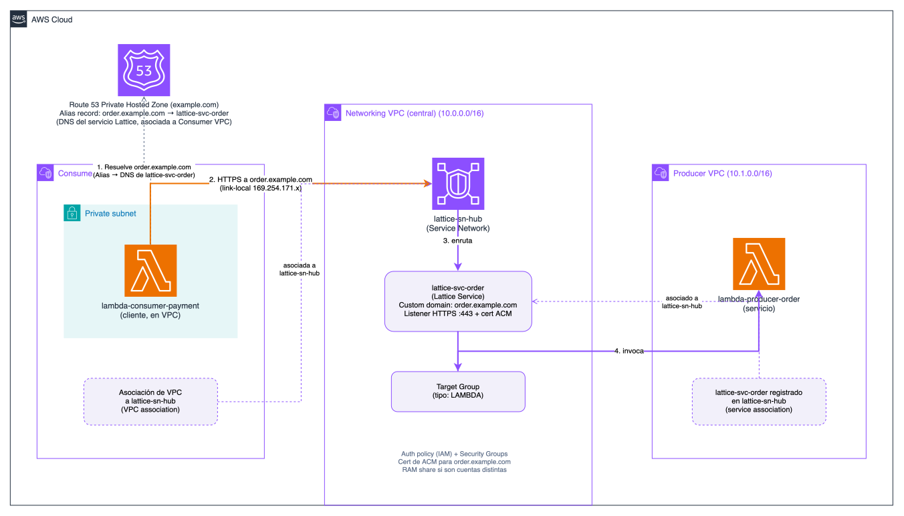

# Laboratorio VPC Lattice

Este directorio contiene la infraestructura Terraform para un laboratorio de VPC Lattice distribuido en una única cuenta AWS con múltiples VPCs: `networking` (hub/service-network), `producer` (servicio expuesto como Lambda) y `consumer` (cliente implementado también como Lambda).



**Resumen de la arquitectura (según el diagrama SVG)**

- VPC de networking (centro del laboratorio)
  - Actúa como hub del Service Network de VPC Lattice.
  - Contiene el `aws_vpclattice_service_network` y la base de conectividad compartida entre los demás módulos.
- VPC producer
  - Alberga el servicio que expone VPC Lattice: una Lambda y los recursos asociados al servicio.
  - Se define el `aws_vpclattice_service`, el `aws_vpclattice_listener` y el `aws_vpclattice_target_group` para exponer la funcionalidad.
  - El servicio se asocia al Service Network para que pueda ser alcanzado por los consumidores.
- VPC consumer
  - Alberga un cliente de prueba implementado como Lambda que invoca el servicio a través del DNS provisionado por VPC Lattice.
  - Se asocia al mismo Service Network para que el tráfico pueda llegar al servicio registrado en `producer`.

Flujo de llamadas (simplificado):
1. `networking` crea el Service Network de VPC Lattice.
2. `producer` registra el servicio, su listener y el target group, y lo asocia al Service Network.
3. `consumer` se une al Service Network y resuelve el DNS del servicio para hacer la petición HTTPS.
4. El Service Network enruta la solicitud al listener y este la entrega al target group, que invoca la Lambda en `producer`.

Autenticación y políticas:
- En este repo el servicio se creó con `auth_type = "AWS_IAM"` (requiere peticiones firmadas SigV4 desde clientes). Para pruebas se puede cambiar a `auth_type = "NONE"` (no recomendado para producción).
- Alternativamente se pueden definir políticas de red (network policies) en VPC Lattice para permitir invocaciones desde VPCs asociadas sin firmar.

Qué hay en este directorio

- `networking/` — VPC central y `aws_vpclattice_service_network`.
- `producer/` — VPC del servicio, Lambda (`lambda/handler.py`), recursos VPC Lattice (service, listener, target group, association).
- `consumer/` — VPC cliente, Lambda consumidora y asociación al Service Network.

Instrucciones rápidas

1. Revisa los módulos y ajusta `availability_zone` o los CIDR si lo deseas.
2. Ejecuta primero Terraform en `networking`:
   - `cd vpc-lattice/networking && terraform init && terraform apply`
3. Una vez creado el Service Network, puedes aplicar `producer` o `consumer` en cualquier orden, ya que no hay dependencia de secuencia entre ellos:
   - `cd ../producer && terraform init && terraform apply`
   - `cd ../consumer && terraform init && terraform apply`
4. Para la Lambda del `producer` empaqueta `lambda/handler.py` en `lambda/handler.zip` o añade el `data "archive_file"` en Terraform para generarlo automáticamente.
5. Si el servicio usa `AWS_IAM` para auth, la Lambda consumidora firma la petición con SigV4 mediante el rol de ejecución o puedes cambiar a `auth_type = "NONE"` para pruebas rápidas.

Ejemplo de invocación firmada (desde la Lambda consumidora o desde un cliente Python con credenciales válidas):

```python
import boto3, requests
from requests_aws4auth import AWS4Auth

session = boto3.Session()
creds = session.get_credentials().get_frozen_credentials()
region = 'us-east-1'
auth = AWS4Auth(creds.access_key, creds.secret_key, region, 'vpc-lattice-svcs', session_token=creds.token)
url = "https://<service-dns>"
r = requests.get(url, auth=auth)
print(r.status_code, r.text)
```

Pruebas y diagnóstico

- Si recibes `AccessDeniedException: User: anonymous is not authorized ... vpc-lattice-svcs:Invoke` significa que tu petición no está firmada (o la política de red no permite invocación anónima).
- Verifica que la VPC `consumer` esté asociada al Service Network y que las subnets listadas en la asociación tengan capacidad de IP para los ENIs que Lattice creará.
- Asegúrate de que los Security Groups permiten tráfico saliente/entrante según corresponda (el SG de la Lambda debe permitir tráfico desde los ENIs del servicio si limitas por SG).

Estimación de coste por hora (aproximada)

> Nota: estos son valores aproximados en USD para región `us-east-1`. Verifica precios actuales en la Calculadora AWS o la página de precios oficial antes de ejecutar. Valores redondeados y conservadores.

- Recursos sin coste por hora directo:
  - `aws_vpc`, `aws_subnet`, `aws_route_table`, `aws_internet_gateway`, `aws_security_group`, `aws_iam_role` — generalmente no tienen coste por hora (costes asociados: tráfico, endpoints, o servicios adicionales).

- Recursos con coste (estimación):
  - Lambda `consumer` (invocaciones bajas y configuración estándar): ~ $0.001/hr a $0.005/hr según uso
  - Lambda `producer` (si llamadas bajas y configuración 128 MB): ~ $0.0015/hr (depende mucho del número de invocaciones y duración)
  - VPC Lattice (service + listener): estimación conservadora ~ $0.02/hr (cobros gestionados por AWS; incluye horas del servicio y costes por petición — varía según uso)

- Total estimado por hora (laboratorio básico, 2 Lambdas + VPC Lattice):

  Aproximado: 0.0015 + 0.0015 + 0.020 = ~ $0.023/hr

- Adicionales (si los añades):
  - NAT Gateway: ~ $0.045/hr + cargos por GB de datos (si habilitas NAT para subnets privadas)
  - Interface VPC Endpoints (PrivateLink): ~ $0.01/hr por endpoint (más tráfico)

Ejemplo con NAT Gateway incluido: ~ $0.032 + $0.045 = ~ $0.077/hr

Consejos para ahorrar costes

- Apaga / destruye recursos que no uses (`terraform destroy`) cuando termines las pruebas.
- Usa instancias de tamaño micro y minimiza la tasa de invocaciones de Lambda durante pruebas.
- Evita mantener NAT Gateways siempre activos si sólo los necesitas para despliegue/actualizaciones.